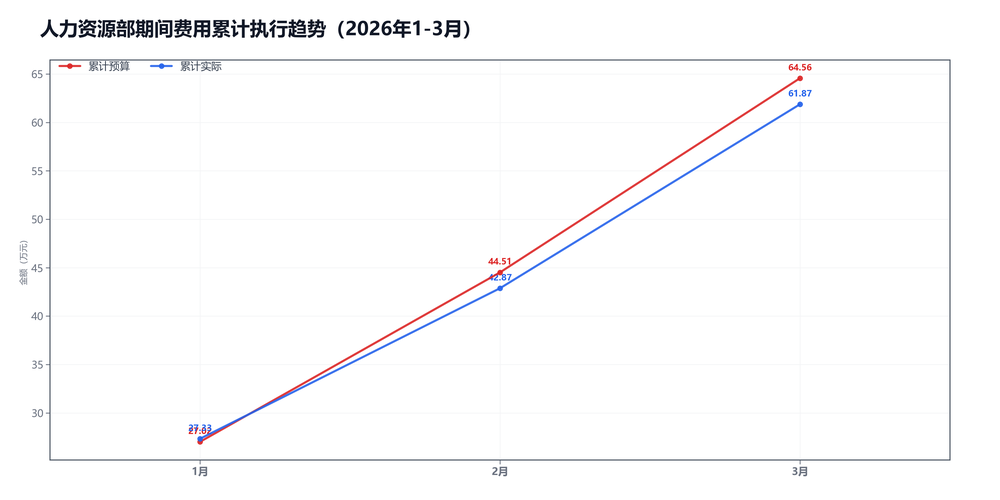

3月人力资源部预算执行情况：

#### 一、结论

- 截至3月，累计省下了2.69万，整体节奏平稳。
- 支出节奏平稳。

#### 二、数据

##### 口径说明
- 期间费用 = 人工费用 + 其他费用。
- 本部门不涉及项目成本口径。

##### 2）累计执行（1-3月）

|指标|累计预算(万)|累计实际(万)|累计省下了/超支|备注|
|---|---|---|---|---|
|项目成本（不适用）|不适用|不适用|不适用|项目成本口径不适用|
|期间费用|64.56|61.87|节约2.69|人工+其他|
|合计|64.56|61.87|节约2.69|累计口径|

##### 3）当月预算控制

|指标|当月预算额度(万)|当月实际发生(万)|当月节约/超支|可结转至下月额度(万)|
|---|---|---|---|---|
|项目成本（不适用）|不适用|不适用|不适用|不适用|
|期间费用|20.05|19.00|节约1.06|—|
|其中：人工费用|14.89|18.07|超支3.18|—|
|其中：其他费用|5.17|0.93|节约4.23|5.17|
|合计|20.05|19.00|节约1.05|—|

#### 三、分析

##### 支出达成情况
- 截至3月，累计偏差主要来自期间费用。项目成本持平0.00万，期间费用节约2.69万。
- 当月期间费用实际19.00万，预算20.05万。
- 当月期间费用较上月增加3.46万，人工增加3.57万，其他减少0.12万。
- 人工费用占比95.1%，其他费用占比4.9%。
- 支出节奏平稳。

#### 四、建议

- 费用提前排期，别集中到月底。

#### 五、图表附件

##### 期间费用累计执行

