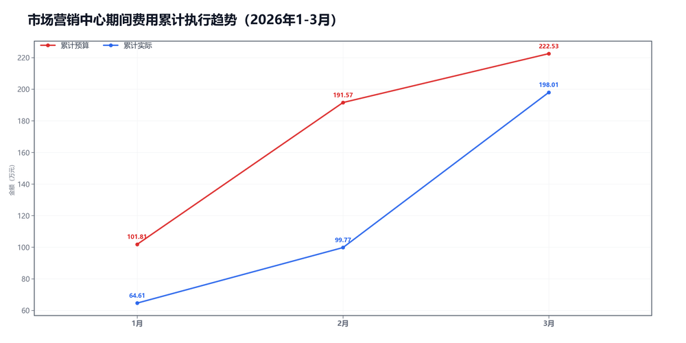

3月市场营销中心预算执行情况：

#### 一、结论

- 截至3月，累计省下了24.52万，整体没有明显拖累项。
- 收入达成不错，收入、毛利率和费用都比较平稳。

#### 二、数据

##### 口径说明
- 期间费用 = 人工费用 + 其他费用。
- 本部门不涉及项目成本口径。

##### 1）收入达成

|指标|当月目标(万)|当月实际(万)|当月达成率|累计目标(万)|累计实际(万)|累计达成率|
|---|---|---|---|---|---|---|
|净额收入|671.00|288.66|43.0%|1952.00|2005.20|102.7%|
|项目毛利润|325.00|88.99|27.4%|945.00|875.31|92.6%|
|毛利率|48.4%|30.8%|-17.6个点|48.4%|43.7%|-4.8个点|

##### 2）累计执行（1-3月）

|指标|累计预算(万)|累计实际(万)|累计省下了/超支|备注|
|---|---|---|---|---|
|项目成本（不适用）|不适用|不适用|不适用|项目成本口径不适用|
|期间费用|222.53|198.01|节约24.52|人工+其他|
|合计|222.53|198.01|节约24.52|累计口径|

##### 3）当月预算控制

|指标|当月预算额度(万)|当月实际发生(万)|当月节约/超支|可结转至下月额度(万)|
|---|---|---|---|---|
|项目成本（不适用）|不适用|不适用|不适用|不适用|
|期间费用|73.66|98.24|超支24.58|—|
|其中：人工费用|58.75|79.53|超支20.78|—|
|其中：其他费用|14.91|18.71|超支3.80|14.91|
|合计|73.66|98.24|超支24.58|—|

#### 三、分析

##### 收入达成情况
- 截至3月，累计净额收入2005.20万，目标1952.00万，比目标多53.20万。
- 累计项目毛利润875.31万，目标945.00万，比目标少69.69万。
- 当月净额收入288.66万，目标671.00万，比目标少382.34万。
- 收入达成不错。

##### 支出达成情况
- 截至3月，累计偏差主要来自期间费用。项目成本持平0.00万，期间费用节约24.52万。
- 当月期间费用实际98.24万，预算73.66万。
- 当月期间费用较上月增加63.09万，人工增加51.78万，其他增加11.31万。
- 人工费用占比81.0%，其他费用占比19.0%。
- 支出节奏平稳。

#### 四、建议

- 先抓最影响结果的那一项。

#### 五、图表附件

##### 期间费用累计执行

