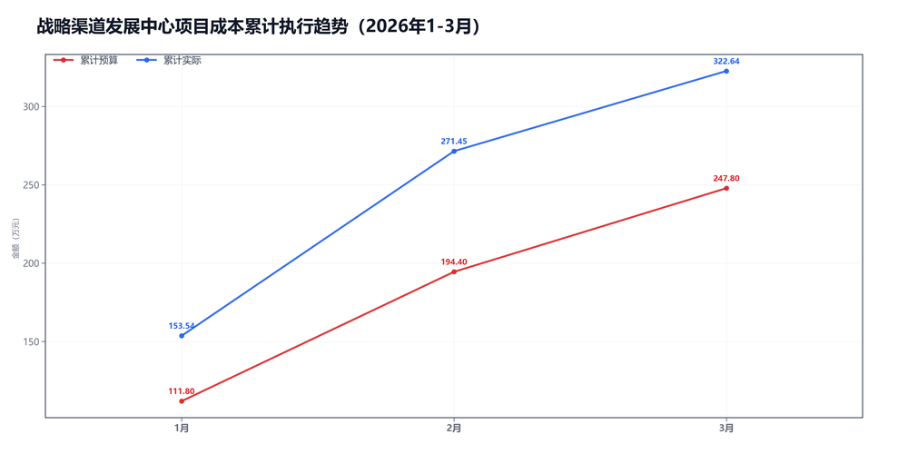
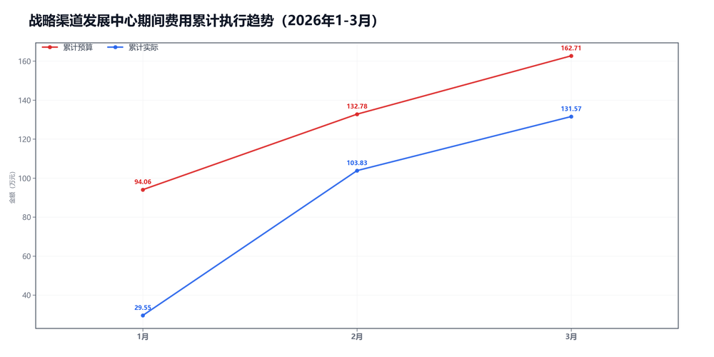

3月战略渠道发展中心预算执行情况：

#### 一、结论

- 截至3月，累计超支0.71万，主因是项目成本。
- 收入达成不错，毛利率低了-7.7个点，项目成本被顶上去了。

#### 二、数据

##### 口径说明
- 期间费用 = 人工费用 + 其他费用。
- 项目成本 = 净额收入 - 项目毛利润。

##### 1）收入达成

|指标|当月目标(万)|当月实际(万)|当月达成率|累计目标(万)|累计实际(万)|累计达成率|
|---|---|---|---|---|---|---|
|净额收入|78.40|66.63|85.0%|352.80|414.01|117.4%|
|项目毛利润|25.00|15.43|61.7%|105.00|91.37|87.0%|
|毛利率|31.9%|23.2%|-8.7个点|29.8%|22.1%|-7.7个点|

##### 2）累计执行（1-3月）

|指标|累计预算(万)|累计实际(万)|累计省下了/超支|备注|
|---|---|---|---|---|
|项目成本|290.80|322.64|超支31.85|主压项|
|期间费用|162.71|131.57|节约31.14|人工+其他|
|合计|453.50|454.21|超支0.71|累计口径|

##### 3）当月预算控制

|指标|当月预算额度(万)|当月实际发生(万)|当月节约/超支|可结转至下月额度(万)|
|---|---|---|---|---|
|项目成本|53.40|51.20|节约2.20|53.40|
|期间费用|33.77|27.74|节约6.03|—|
|其中：人工费用|23.55|21.88|节约1.67|—|
|其中：其他费用|10.22|5.85|节约4.37|10.22|
|合计|87.17|78.93|节约8.24|—|

#### 三、分析

##### 收入达成情况
- 截至3月，累计净额收入414.01万，目标352.80万，比目标多61.21万。
- 累计项目毛利润91.37万，目标105.00万，比目标少13.63万。
- 累计毛利率22.1%，目标29.8%，偏差-7.7个点。
- 收入达成不错，但毛利率不够。

##### 支出达成情况
- 截至3月，累计偏差主要来自项目成本。项目成本超支31.85万，期间费用节约31.14万。
- 当月项目成本实际51.20万，预算53.40万；期间费用实际27.74万，预算33.77万。
- 项目成本主要构成：返费31.89万；其他运营成本14.24万；商业险4.27万。
- 当月期间费用较上月减少46.55万，人工减少42.35万，其他减少4.19万。
- 人工费用占比78.9%，其他费用占比21.1%。 返费/净额收入47.9%。
- 主要还是毛利率不够。

#### 四、建议

- 先核对返费和定价。

#### 五、图表附件

##### 项目成本累计执行

##### 期间费用累计执行

