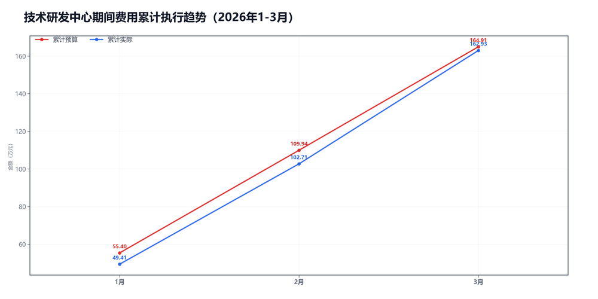

3月技术研发中心预算执行情况：

#### 一、结论

- 截至3月，累计省下了1.98万，整体节奏平稳。
- 支出节奏平稳。

#### 二、数据

##### 口径说明
- 期间费用 = 人工费用 + 其他费用。
- 本部门不涉及项目成本口径。

##### 2）累计执行（1-3月）

|指标|累计预算(万)|累计实际(万)|累计省下了/超支|备注|
|---|---|---|---|---|
|项目成本（不适用）|不适用|不适用|不适用|项目成本口径不适用|
|期间费用|164.91|162.93|节约1.98|人工+其他|
|合计|164.91|162.93|节约1.98|累计口径|

##### 3）当月预算控制

|指标|当月预算额度(万)|当月实际发生(万)|当月节约/超支|可结转至下月额度(万)|
|---|---|---|---|---|
|项目成本（不适用）|不适用|不适用|不适用|不适用|
|期间费用|54.97|60.21|超支5.24|—|
|其中：人工费用|49.09|54.59|超支5.50|—|
|其中：其他费用|5.88|5.63|节约0.25|5.88|
|合计|54.97|60.21|超支5.24|—|

#### 三、分析

##### 支出达成情况
- 截至3月，累计偏差主要来自期间费用。项目成本持平0.00万，期间费用节约1.98万。
- 当月期间费用实际60.21万，预算54.97万。
- 当月期间费用较上月增加6.91万，人工增加6.98万，其他减少0.07万。
- 人工费用占比90.7%，其他费用占比9.3%。
- 支出节奏平稳。

#### 四、建议

- 费用提前排期，别集中到月底。

#### 五、图表附件

##### 期间费用累计执行

