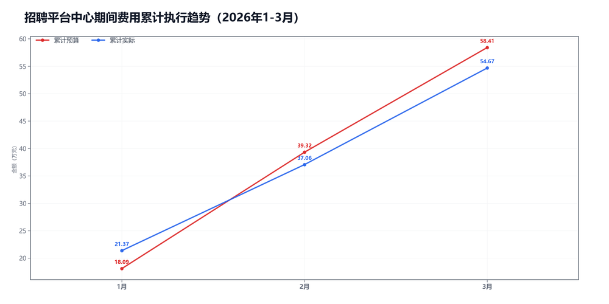

3月招聘平台中心预算执行情况：

#### 一、结论

- 截至3月，累计省下了3.74万，整体节奏平稳。
- 其他费用投早了，先看差旅、服务费和招待费。

#### 二、数据

##### 口径说明
- 期间费用 = 人工费用 + 其他费用。
- 本部门不涉及项目成本口径。

##### 2）累计执行（1-3月）

|指标|累计预算(万)|累计实际(万)|累计省下了/超支|备注|
|---|---|---|---|---|
|项目成本（不适用）|不适用|不适用|不适用|项目成本口径不适用|
|期间费用|58.41|54.67|节约3.74|人工+其他|
|合计|58.41|54.67|节约3.74|累计口径|

##### 3）当月预算控制

|指标|当月预算额度(万)|当月实际发生(万)|当月节约/超支|可结转至下月额度(万)|
|---|---|---|---|---|
|项目成本（不适用）|不适用|不适用|不适用|不适用|
|期间费用|19.09|17.61|节约1.48|—|
|其中：人工费用|13.78|13.46|节约0.32|—|
|其中：其他费用|5.31|4.15|节约1.16|5.31|
|合计|19.09|17.61|节约1.48|—|

#### 三、分析

##### 支出达成情况
- 截至3月，累计偏差主要来自期间费用。项目成本持平0.00万，期间费用节约3.74万。
- 当月期间费用实际17.61万，预算19.09万。
- 当月期间费用较上月增加1.92万，人工减少0.02万，其他增加1.94万。
- 人工费用占比76.4%，其他费用占比23.6%。
- 其他费用投早了。

#### 四、建议

- 差旅、招待、服务费别堆到月末。

#### 五、图表附件

##### 期间费用累计执行

