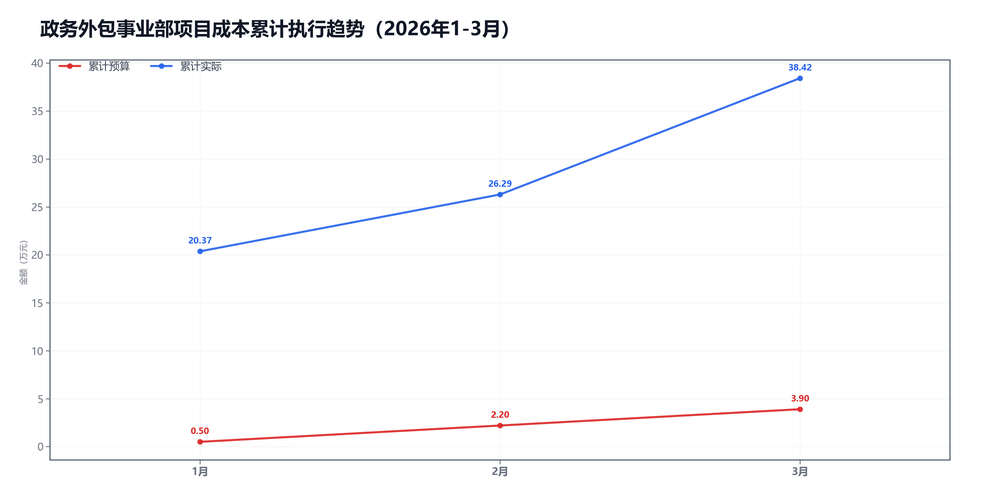
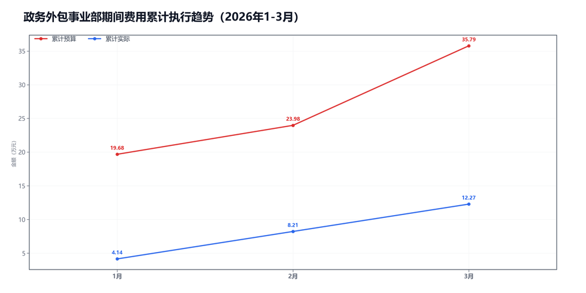

3月政务外包事业部预算执行情况：

#### 一、结论

- 截至3月，累计超支4.89万，主因是项目成本。
- 收入明显超目标，毛利率低了-46.1个点，项目成本被顶上去了。

#### 二、数据

##### 口径说明
- 期间费用 = 人工费用 + 其他费用。
- 项目成本 = 净额收入 - 项目毛利润。

##### 1）收入达成

|指标|当月目标(万)|当月实际(万)|当月达成率|累计目标(万)|累计实际(万)|累计达成率|
|---|---|---|---|---|---|---|
|净额收入|8.00|22.31|278.9%|24.00|61.66|256.9%|
|项目毛利润|6.30|10.18|161.6%|20.10|23.24|115.6%|
|毛利率|78.8%|45.6%|-33.1个点|83.8%|37.7%|-46.1个点|

##### 2）累计执行（1-3月）

|指标|累计预算(万)|累计实际(万)|累计省下了/超支|备注|
|---|---|---|---|---|
|项目成本|10.02|38.42|超支28.40|主压项|
|期间费用|35.79|12.27|节约23.51|人工+其他|
|合计|45.81|50.70|超支4.89|累计口径|

##### 3）当月预算控制

|指标|当月预算额度(万)|当月实际发生(万)|当月节约/超支|可结转至下月额度(万)|
|---|---|---|---|---|
|项目成本|1.70|12.13|超支10.43|1.70|
|期间费用|4.18|4.06|节约0.12|—|
|其中：人工费用|3.71|3.69|节约0.02|—|
|其中：其他费用|0.47|0.37|节约0.10|0.47|
|合计|5.88|16.19|超支10.31|—|

#### 三、分析

##### 收入达成情况
- 截至3月，累计净额收入61.66万，目标24.00万，比目标多37.66万。
- 累计项目毛利润23.24万，目标20.10万，比目标多3.14万。
- 累计毛利率37.7%，目标83.8%，偏差-46.1个点。
- 收入明显超目标，但毛利率不够。

##### 支出达成情况
- 截至3月，累计偏差主要来自项目成本。项目成本超支28.40万，期间费用节约23.51万。
- 当月项目成本实际12.13万，预算1.70万；期间费用实际4.06万，预算4.18万。
- 项目成本主要构成：其他运营成本11.56万；附加税0.57万。
- 当月期间费用较上月减少0.02万，人工减少0.12万，其他增加0.11万。
- 人工费用占比90.9%，其他费用占比9.1%。
- 主要还是毛利率不够。

#### 四、建议

- 先核对返费和定价。

#### 五、图表附件

##### 项目成本累计执行

##### 期间费用累计执行

