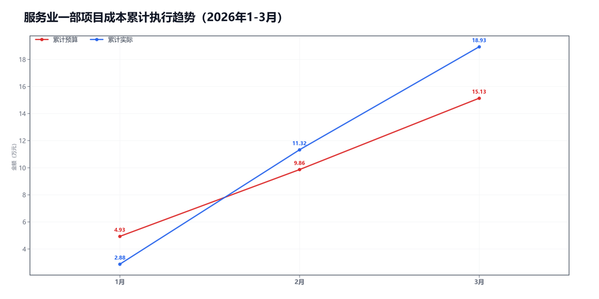
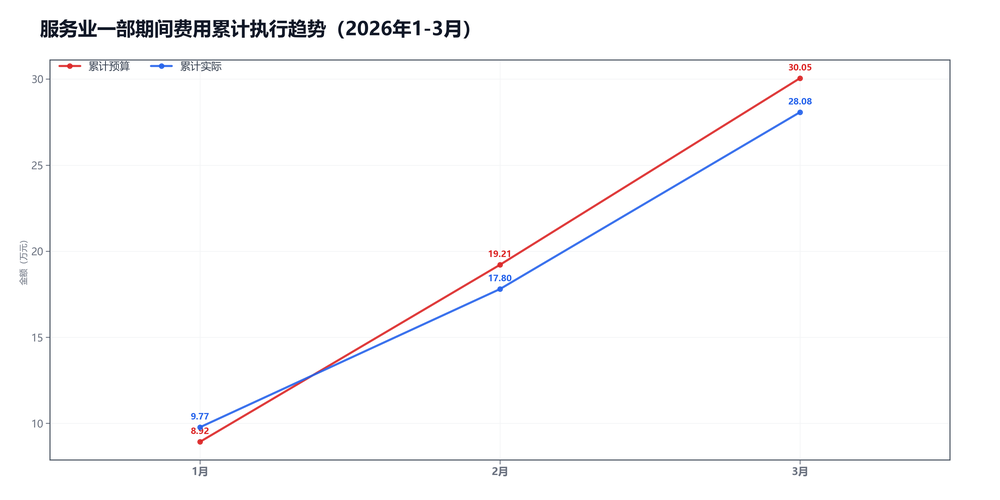

3月服务业一部预算执行情况：

#### 一、结论

- 截至3月，累计超支4.01万，主因是项目成本。
- 收入没跟上，收入、毛利率和费用都在拉扯。

#### 二、数据

##### 口径说明
- 期间费用 = 人工费用 + 其他费用。
- 项目成本 = 净额收入 - 项目毛利润。

##### 1）收入达成

|指标|当月目标(万)|当月实际(万)|当月达成率|累计目标(万)|累计实际(万)|累计达成率|
|---|---|---|---|---|---|---|
|净额收入|22.51|19.19|85.2%|65.71|56.18|85.5%|
|项目毛利润|17.24|11.58|67.2%|50.58|37.26|73.7%|
|毛利率|76.6%|60.4%|-16.2个点|77.0%|66.3%|-10.7个点|

##### 2）累计执行（1-3月）

|指标|累计预算(万)|累计实际(万)|累计省下了/超支|备注|
|---|---|---|---|---|
|项目成本|12.94|18.93|超支5.99|主压项|
|期间费用|30.05|28.08|节约1.98|人工+其他|
|合计|42.99|47.00|超支4.01|累计口径|

##### 3）当月预算控制

|指标|当月预算额度(万)|当月实际发生(万)|当月节约/超支|可结转至下月额度(万)|
|---|---|---|---|---|
|项目成本|5.27|7.61|超支2.34|5.27|
|期间费用|12.72|10.28|节约2.44|—|
|其中：人工费用|11.18|9.87|节约1.31|—|
|其中：其他费用|1.54|0.40|节约1.13|1.54|
|合计|17.99|17.88|节约0.11|—|

#### 三、分析

##### 收入达成情况
- 截至3月，累计净额收入56.18万，目标65.71万，比目标少9.53万。
- 累计项目毛利润37.26万，目标50.58万，比目标少13.32万。
- 累计毛利率66.3%，目标77.0%，偏差-10.7个点。
- 收入和毛利率都偏弱。

##### 支出达成情况
- 截至3月，累计偏差主要来自项目成本。项目成本超支5.99万，期间费用节约1.98万。
- 当月项目成本实际7.61万，预算5.27万；期间费用实际10.28万，预算12.72万。
- 项目成本主要构成：返费6.04万；附加税1.68万；其他运营成本-0.12万。
- 当月期间费用较上月增加2.25万，人工增加2.25万，其他减少0.01万。
- 人工费用占比96.1%，其他费用占比3.9%。 返费/净额收入31.5%。
- 收入和毛利率都偏弱。

#### 四、建议

- 先抓最影响结果的那一项。

#### 五、图表附件

##### 项目成本累计执行

##### 期间费用累计执行

