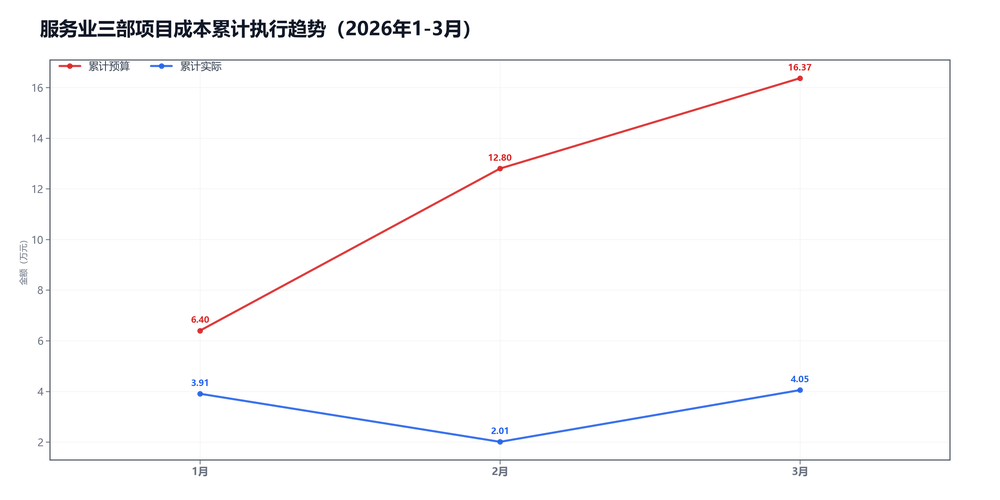
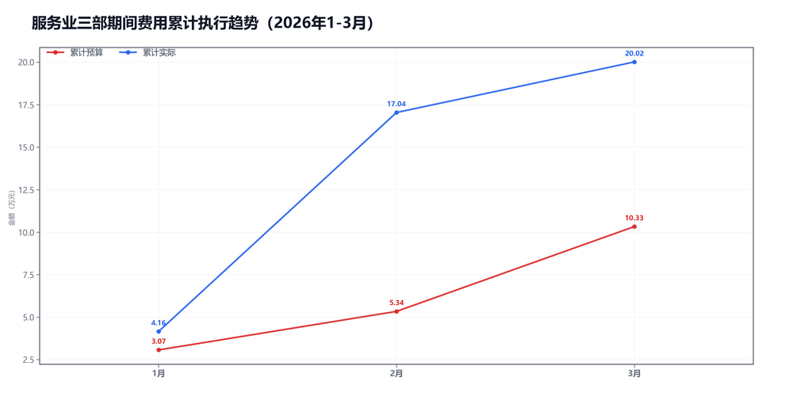

3月服务业三部预算执行情况：

#### 一、结论

- 截至3月，累计超支4.66万，主因是期间费用。
- 收入没跟上。

#### 二、数据

##### 口径说明
- 期间费用 = 人工费用 + 其他费用。
- 项目成本 = 净额收入 - 项目毛利润。

##### 1）收入达成

|指标|当月目标(万)|当月实际(万)|当月达成率|累计目标(万)|累计实际(万)|累计达成率|
|---|---|---|---|---|---|---|
|净额收入|11.77|8.78|74.6%|33.97|18.83|55.4%|
|项目毛利润|8.20|6.73|82.1%|17.60|14.78|84.0%|
|毛利率|69.7%|76.7%|+7.1个点|51.8%|78.5%|+26.7个点|

##### 2）累计执行（1-3月）

|指标|累计预算(万)|累计实际(万)|累计省下了/超支|备注|
|---|---|---|---|---|
|项目成本|9.07|4.05|节约5.02|项目口径|
|期间费用|10.33|20.02|超支9.69|人工+其他|
|合计|19.40|24.07|超支4.67|累计口径|

##### 3）当月预算控制

|指标|当月预算额度(万)|当月实际发生(万)|当月节约/超支|可结转至下月额度(万)|
|---|---|---|---|---|
|项目成本|3.57|2.04|节约1.53|3.57|
|期间费用|6.85|2.98|节约3.87|—|
|其中：人工费用|5.45|2.54|节约2.91|—|
|其中：其他费用|1.40|0.44|节约0.96|1.40|
|合计|10.42|5.02|节约5.40|—|

#### 三、分析

##### 收入达成情况
- 截至3月，累计净额收入18.83万，目标33.97万，比目标少15.14万。
- 累计项目毛利润14.78万，目标17.60万，比目标少2.82万。
- 累计毛利率78.5%，目标51.8%，偏差+26.7个点。
- 收入没跟上。

##### 支出达成情况
- 截至3月，累计偏差主要来自期间费用。项目成本节约5.02万，期间费用超支9.69万。
- 当月项目成本实际2.04万，预算3.57万；期间费用实际2.98万，预算6.85万。
- 项目成本主要构成：返费1.71万；附加税0.43万；其他运营成本-0.09万。
- 当月期间费用较上月减少9.91万，人工减少4.61万，其他减少5.29万。
- 人工费用占比85.2%，其他费用占比14.8%。
- 主要还是收入没跟上。

#### 四、建议

- 先把收入缺口补上。

#### 五、图表附件

##### 项目成本累计执行

##### 期间费用累计执行

