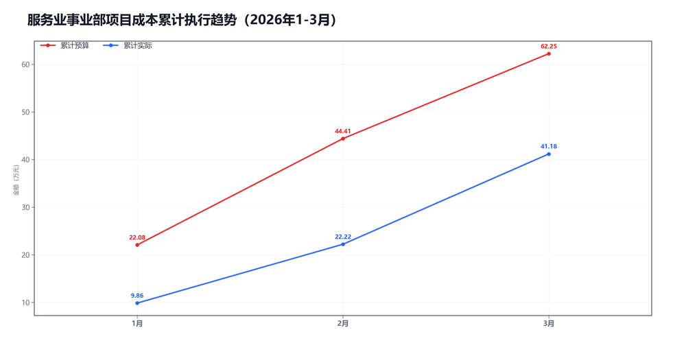
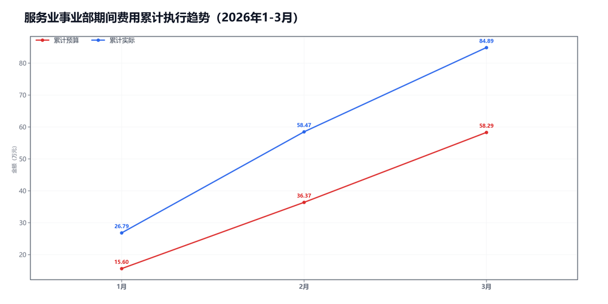

3月服务业事业部预算执行情况：

#### 一、结论

- 截至3月，累计超支27.13万，主因是期间费用。
- 收入没跟上。

#### 二、数据

##### 口径说明
- 期间费用 = 人工费用 + 其他费用。
- 项目成本 = 净额收入 - 项目毛利润。

##### 1）收入达成

|指标|当月目标(万)|当月实际(万)|当月达成率|累计目标(万)|累计实际(万)|累计达成率|
|---|---|---|---|---|---|---|
|净额收入|61.28|40.47|66.0%|169.68|110.81|65.3%|
|项目毛利润|43.44|21.51|49.5%|107.43|69.62|64.8%|
|毛利率|70.9%|53.1%|-17.7个点|63.3%|62.8%|-0.5个点|

##### 2）累计执行（1-3月）

|指标|累计预算(万)|累计实际(万)|累计省下了/超支|备注|
|---|---|---|---|---|
|项目成本|40.65|41.18|超支0.53|项目口径|
|期间费用|58.29|84.89|超支26.60|人工+其他|
|合计|98.94|126.08|超支27.14|累计口径|

##### 3）当月预算控制

|指标|当月预算额度(万)|当月实际发生(万)|当月节约/超支|可结转至下月额度(万)|
|---|---|---|---|---|
|项目成本|17.84|18.96|超支1.12|17.84|
|期间费用|33.22|26.42|节约6.80|—|
|其中：人工费用|29.27|25.00|节约4.28|—|
|其中：其他费用|3.95|1.42|节约2.52|3.95|
|合计|51.06|45.38|节约5.68|—|

#### 三、分析

##### 收入达成情况
- 截至3月，累计净额收入110.81万，目标169.68万，比目标少58.87万。
- 累计项目毛利润69.62万，目标107.43万，比目标少37.81万。
- 累计毛利率62.8%，目标63.3%，偏差-0.5个点。
- 收入没跟上。

##### 支出达成情况
- 截至3月，累计偏差主要来自期间费用。项目成本超支0.53万，期间费用超支26.60万。
- 当月项目成本实际18.96万，预算17.84万；期间费用实际26.42万，预算33.22万。
- 项目成本主要构成：返费10.64万；附加税6.50万；其他运营成本1.83万。
- 当月期间费用较上月减少5.26万，人工增加0.33万，其他减少5.58万。
- 人工费用占比94.6%，其他费用占比5.4%。 返费/净额收入26.3%。
- 主要还是收入没跟上。

#### 四、建议

- 先把收入缺口补上。

#### 五、图表附件

##### 项目成本累计执行

##### 期间费用累计执行

