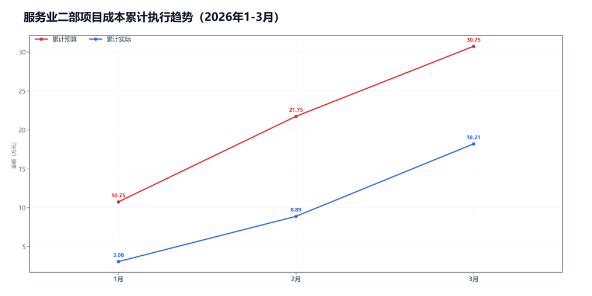
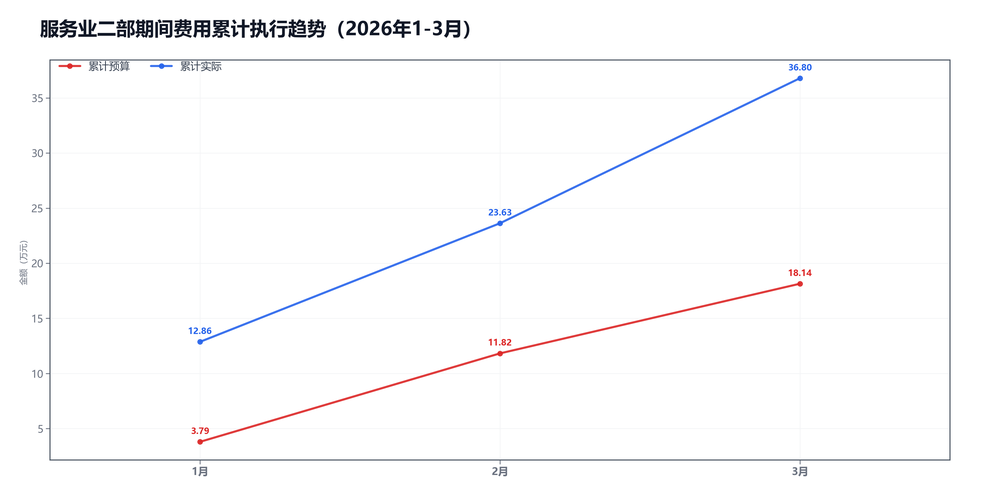

3月服务业二部预算执行情况：

#### 一、结论

- 截至3月，累计超支21.14万，主因是期间费用。
- 收入没跟上，收入、毛利率和费用都在拉扯。

#### 二、数据

##### 口径说明
- 期间费用 = 人工费用 + 其他费用。
- 项目成本 = 净额收入 - 项目毛利润。

##### 1）收入达成

|指标|当月目标(万)|当月实际(万)|当月达成率|累计目标(万)|累计实际(万)|累计达成率|
|---|---|---|---|---|---|---|
|净额收入|27.00|12.51|46.3%|70.00|35.79|51.1%|
|项目毛利润|18.00|3.19|17.7%|39.25|17.59|44.8%|
|毛利率|66.7%|25.5%|-41.2个点|56.1%|49.1%|-6.9个点|

##### 2）累计执行（1-3月）

|指标|累计预算(万)|累计实际(万)|累计省下了/超支|备注|
|---|---|---|---|---|
|项目成本|15.72|18.21|超支2.48|项目口径|
|期间费用|18.14|36.80|超支18.66|人工+其他|
|合计|33.87|55.01|超支21.14|累计口径|

##### 3）当月预算控制

|指标|当月预算额度(万)|当月实际发生(万)|当月节约/超支|可结转至下月额度(万)|
|---|---|---|---|---|
|项目成本|9.00|9.31|超支0.31|9.00|
|期间费用|13.66|13.17|节约0.49|—|
|其中：人工费用|12.65|12.59|节约0.06|—|
|其中：其他费用|1.01|0.58|节约0.43|1.01|
|合计|22.66|22.48|节约0.18|—|

#### 三、分析

##### 收入达成情况
- 截至3月，累计净额收入35.79万，目标70.00万，比目标少34.21万。
- 累计项目毛利润17.59万，目标39.25万，比目标少21.66万。
- 累计毛利率49.1%，目标56.1%，偏差-6.9个点。
- 收入和毛利率都偏弱。

##### 支出达成情况
- 截至3月，累计偏差主要来自期间费用。项目成本超支2.48万，期间费用超支18.66万。
- 当月项目成本实际9.31万，预算9.00万；期间费用实际13.17万，预算13.66万。
- 项目成本主要构成：附加税4.39万；返费2.89万；其他运营成本2.03万。
- 当月期间费用较上月增加2.40万，人工增加2.69万，其他减少0.28万。
- 人工费用占比95.6%，其他费用占比4.4%。 返费/净额收入23.1%。
- 收入和毛利率都偏弱。

#### 四、建议

- 先抓最影响结果的那一项。

#### 五、图表附件

##### 项目成本累计执行

##### 期间费用累计执行

