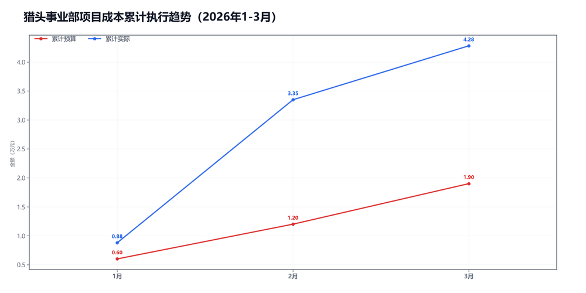
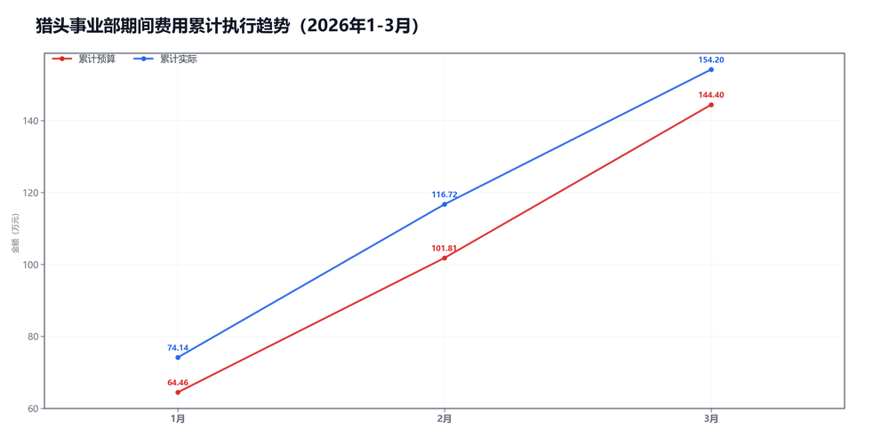

3月猎头事业部预算执行情况：

#### 一、结论

- 截至3月，累计超支12.13万，主因是期间费用。
- 收入达成不错，主要是费用前置。

#### 二、数据

##### 口径说明
- 期间费用 = 人工费用 + 其他费用。
- 项目成本 = 净额收入 - 项目毛利润。

##### 1）收入达成

|指标|当月目标(万)|当月实际(万)|当月达成率|累计目标(万)|累计实际(万)|累计达成率|
|---|---|---|---|---|---|---|
|净额收入|65.00|58.43|89.9%|170.00|174.86|102.9%|
|项目毛利润|64.30|57.50|89.4%|168.10|170.58|101.5%|
|毛利率|98.9%|98.4%|-0.5个点|98.9%|97.6%|-1.3个点|

##### 2）累计执行（1-3月）

|指标|累计预算(万)|累计实际(万)|累计省下了/超支|备注|
|---|---|---|---|---|
|项目成本|1.95|4.28|超支2.33|项目口径|
|期间费用|144.40|154.20|超支9.81|人工+其他|
|合计|146.35|158.48|超支12.13|累计口径|

##### 3）当月预算控制

|指标|当月预算额度(万)|当月实际发生(万)|当月节约/超支|可结转至下月额度(万)|
|---|---|---|---|---|
|项目成本|0.70|0.93|超支0.23|0.70|
|期间费用|48.57|37.48|节约11.09|—|
|其中：人工费用|43.04|33.13|节约9.91|—|
|其中：其他费用|5.53|4.35|节约1.18|5.53|
|合计|49.27|38.41|节约10.86|—|

#### 三、分析

##### 收入达成情况
- 截至3月，累计净额收入174.86万，目标170.00万，比目标多4.86万。
- 累计项目毛利润170.58万，目标168.10万，比目标多2.48万。
- 累计毛利率97.6%，目标98.9%，偏差-1.3个点。
- 收入达成不错。

##### 支出达成情况
- 截至3月，累计偏差主要来自期间费用。项目成本超支2.33万，期间费用超支9.81万。
- 当月项目成本实际0.93万，预算0.70万；期间费用实际37.48万，预算48.57万。
- 项目成本主要构成：其他运营成本0.51万；附加税0.42万。
- 当月期间费用较上月减少5.10万，人工减少5.53万，其他增加0.44万。
- 人工费用占比88.4%，其他费用占比11.6%。
- 费用节奏前置。

#### 四、建议

- 费用先压住，差旅和服务费提前排。

#### 五、图表附件

##### 项目成本累计执行

##### 期间费用累计执行

