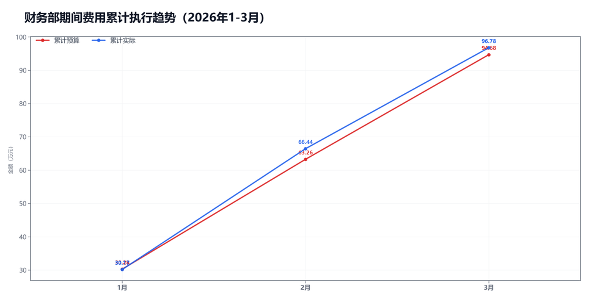

3月财务部预算执行情况：

#### 一、结论

- 截至3月，累计超支2.10万，压力主要在人工费用偏高。
- 人工费用占比高，先核编制和奖金节奏。

#### 二、数据

##### 口径说明
- 期间费用 = 人工费用 + 其他费用。
- 本部门不涉及项目成本口径。

##### 2）累计执行（1-3月）

|指标|累计预算(万)|累计实际(万)|累计省下了/超支|备注|
|---|---|---|---|---|
|项目成本（不适用）|不适用|不适用|不适用|项目成本口径不适用|
|期间费用|94.68|96.78|超支2.10|人工+其他|
|合计|94.68|96.78|超支2.10|累计口径|

##### 3）当月预算控制

|指标|当月预算额度(万)|当月实际发生(万)|当月节约/超支|可结转至下月额度(万)|
|---|---|---|---|---|
|项目成本（不适用）|不适用|不适用|不适用|不适用|
|期间费用|31.42|30.34|节约1.08|—|
|其中：人工费用|28.26|26.61|节约1.65|—|
|其中：其他费用|3.16|3.73|超支0.57|3.16|
|合计|31.42|30.34|节约1.08|—|

#### 三、分析

##### 支出达成情况
- 截至3月，累计偏差主要来自期间费用。项目成本持平0.00万，期间费用超支2.10万。
- 当月期间费用实际30.34万，预算31.42万。
- 当月期间费用较上月减少5.94万，人工减少4.67万，其他减少1.27万。
- 人工费用占比87.7%，其他费用占比12.3%。
- 人工费用偏高。

#### 四、建议

- 先核对编制和奖金节奏。

#### 五、图表附件

##### 期间费用累计执行

