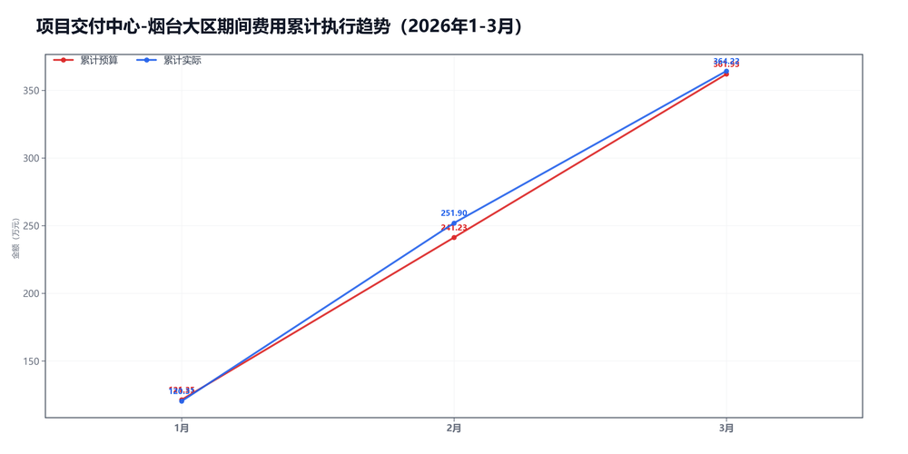

3月项目交付中心-烟台大区预算执行情况：

#### 一、结论

- 截至3月，累计省下了39.68万，整体没有明显拖累项。
- 收入，收入、毛利率和费用都比较平稳。

#### 二、数据

##### 口径说明
- 期间费用 = 人工费用 + 其他费用。
- 本部门不涉及项目成本口径。

##### 1）收入达成

|指标|当月目标(万)|当月实际(万)|当月达成率|累计目标(万)|累计实际(万)|累计达成率|
|---|---|---|---|---|---|---|
|净额收入|0.00|0.00|—|0.00|0.00|—|
|项目毛利润|0.00|0.00|—|0.00|0.00|—|
|毛利率|—|—|—|—|—|—|

##### 2）累计执行（1-3月）

|指标|累计预算(万)|累计实际(万)|累计省下了/超支|备注|
|---|---|---|---|---|
|项目成本（不适用）|不适用|不适用|不适用|项目成本口径不适用|
|期间费用|403.90|364.22|节约39.68|人工+其他|
|合计|403.90|364.22|节约39.68|累计口径|

##### 3）当月预算控制

|指标|当月预算额度(万)|当月实际发生(万)|当月节约/超支|可结转至下月额度(万)|
|---|---|---|---|---|
|项目成本（不适用）|不适用|不适用|不适用|不适用|
|期间费用|120.70|112.32|节约8.38|—|
|其中：人工费用|101.84|94.70|节约7.14|—|
|其中：其他费用|18.86|17.63|节约1.23|18.86|
|合计|120.70|112.32|节约8.38|—|

#### 三、分析

##### 收入达成情况
- 截至3月，累计净额收入0.00万，目标0.00万，与目标基本持平。
- 累计项目毛利润0.00万，目标0.00万，与目标基本持平。
- 当月净额收入0.00万，目标0.00万，与目标基本持平。
- 收入。

##### 支出达成情况
- 截至3月，累计偏差主要来自期间费用。项目成本持平0.00万，期间费用节约39.68万。
- 当月期间费用实际112.32万，预算120.70万。
- 当月期间费用较上月减少19.26万，人工减少12.80万，其他减少6.46万。
- 人工费用占比84.3%，其他费用占比15.7%。
- 支出节奏平稳。

#### 四、建议

- 先抓最影响结果的那一项。

#### 五、图表附件

##### 期间费用累计执行

