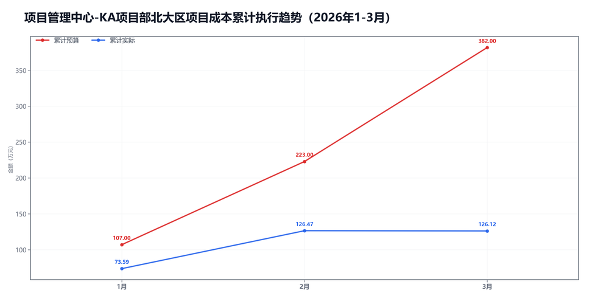
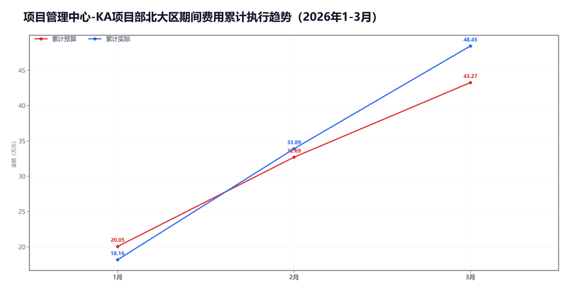

3月项目管理中心-KA项目部北大区预算执行情况：

#### 一、结论

- 截至3月，累计省下了173.77万，主要来自项目成本。
- 收入没跟上。

#### 二、数据

##### 口径说明
- 期间费用 = 人工费用 + 其他费用。
- 项目成本 = 净额收入 - 项目毛利润。

##### 1）收入达成

|指标|当月目标(万)|当月实际(万)|当月达成率|累计目标(万)|累计实际(万)|累计达成率|
|---|---|---|---|---|---|---|
|净额收入|299.00|174.27|58.3%|932.00|744.33|79.9%|
|项目毛利润|140.00|174.61|124.7%|550.00|618.21|112.4%|
|毛利率|46.8%|100.2%|+53.4个点|59.0%|83.1%|+24.0个点|

##### 2）累计执行（1-3月）

|指标|累计预算(万)|累计实际(万)|累计省下了/超支|备注|
|---|---|---|---|---|
|项目成本|305.08|126.12|节约178.96|项目口径|
|期间费用|43.27|48.45|超支5.18|人工+其他|
|合计|348.35|174.57|节约173.78|累计口径|

##### 3）当月预算控制

|指标|当月预算额度(万)|当月实际发生(万)|当月节约/超支|可结转至下月额度(万)|
|---|---|---|---|---|
|项目成本|159.00|-0.35|节约159.35|159.00|
|期间费用|17.88|14.56|节约3.31|—|
|其中：人工费用|16.23|14.32|节约1.90|—|
|其中：其他费用|1.65|0.24|节约1.41|1.65|
|合计|176.88|14.22|节约162.66|—|

#### 三、分析

##### 收入达成情况
- 截至3月，累计净额收入744.33万，目标932.00万，比目标少187.67万。
- 累计项目毛利润618.21万，目标550.00万，比目标多68.21万。
- 累计毛利率83.1%，目标59.0%，偏差+24.0个点。
- 收入没跟上。

##### 支出达成情况
- 截至3月，累计偏差主要来自项目成本。项目成本节约178.96万，期间费用超支5.18万。
- 当月项目成本实际-0.35万，预算159.00万；期间费用实际14.56万，预算17.88万。
- 项目成本主要构成：返费-18.04万；附加税13.08万；商业险4.42万。
- 当月期间费用较上月减少1.16万，人工增加1.52万，其他减少2.68万。
- 人工费用占比98.3%，其他费用占比1.7%。
- 主要还是收入没跟上。

#### 四、建议

- 先把收入缺口补上。

#### 五、图表附件

##### 项目成本累计执行

##### 期间费用累计执行

