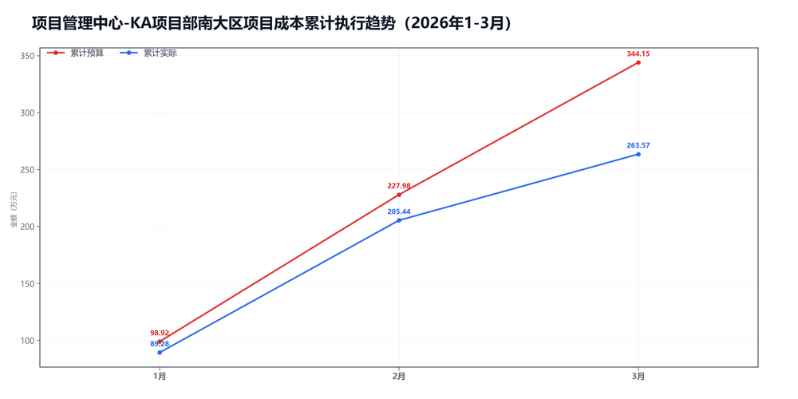
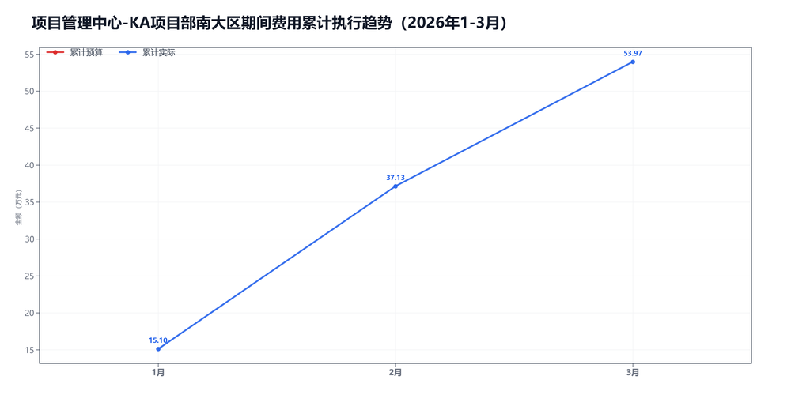

3月项目管理中心-KA项目部南大区预算执行情况：

#### 一、结论

- 截至3月，累计超支24.01万，主因是期间费用。
- 收入没跟上。

#### 二、数据

##### 口径说明
- 期间费用 = 人工费用 + 其他费用。
- 项目成本 = 净额收入 - 项目毛利润。

##### 1）收入达成

|指标|当月目标(万)|当月实际(万)|当月达成率|累计目标(万)|累计实际(万)|累计达成率|
|---|---|---|---|---|---|---|
|净额收入|215.00|154.77|72.0%|637.00|543.30|85.3%|
|项目毛利润|98.83|96.64|97.8%|292.85|279.73|95.5%|
|毛利率|46.0%|62.4%|+16.5个点|46.0%|51.5%|+5.5个点|

##### 2）累计执行（1-3月）

|指标|累计预算(万)|累计实际(万)|累计省下了/超支|备注|
|---|---|---|---|---|
|项目成本|293.53|263.57|节约29.96|项目口径|
|期间费用|0.00|53.97|超支53.97|人工+其他|
|合计|293.53|317.54|超支24.01|累计口径|

##### 3）当月预算控制

|指标|当月预算额度(万)|当月实际发生(万)|当月节约/超支|可结转至下月额度(万)|
|---|---|---|---|---|
|项目成本|116.17|58.13|节约58.04|116.17|
|期间费用|0.00|16.84|超支16.84|—|
|其中：人工费用|0.00|15.37|超支15.37|—|
|其中：其他费用|0.00|1.47|超支1.47|0.00|
|合计|116.17|74.97|节约41.20|—|

#### 三、分析

##### 收入达成情况
- 截至3月，累计净额收入543.30万，目标637.00万，比目标少93.70万。
- 累计项目毛利润279.73万，目标292.85万，比目标少13.12万。
- 累计毛利率51.5%，目标46.0%，偏差+5.5个点。
- 收入没跟上。

##### 支出达成情况
- 截至3月，累计偏差主要来自期间费用。项目成本节约29.96万，期间费用超支53.97万。
- 当月项目成本实际58.13万，预算116.17万；期间费用实际16.84万，预算0.00万。
- 项目成本主要构成：其他运营成本27.76万；返费22.74万；附加税4.01万。
- 当月期间费用较上月减少5.20万，人工减少2.60万，其他减少2.60万。
- 人工费用占比91.3%，其他费用占比8.7%。
- 主要还是收入没跟上。

#### 四、建议

- 先把收入缺口补上。

#### 五、图表附件

##### 项目成本累计执行

##### 期间费用累计执行

