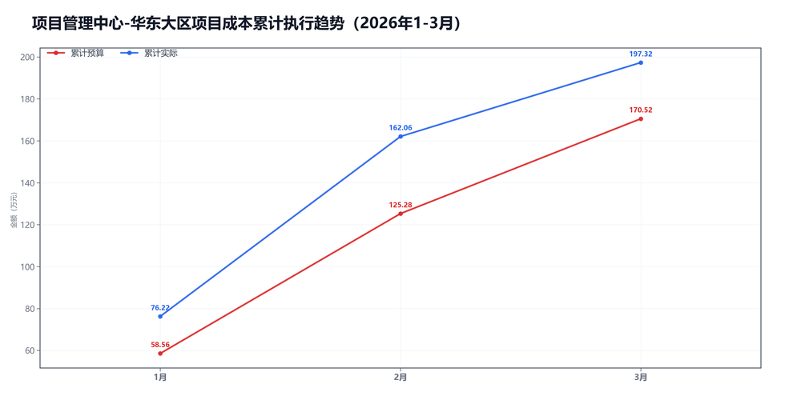
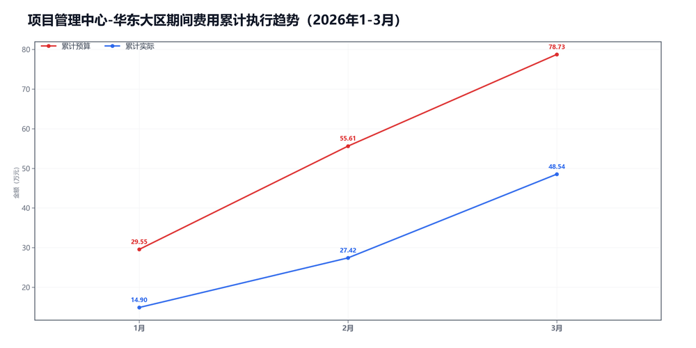

3月项目管理中心-华东大区预算执行情况：

#### 一、结论

- 截至3月，累计省下了17.37万，主要来自期间费用。
- 收入达成不错，毛利率低了-3.0个点，项目成本被顶上去了。

#### 二、数据

##### 口径说明
- 期间费用 = 人工费用 + 其他费用。
- 项目成本 = 净额收入 - 项目毛利润。

##### 1）收入达成

|指标|当月目标(万)|当月实际(万)|当月达成率|累计目标(万)|累计实际(万)|累计达成率|
|---|---|---|---|---|---|---|
|净额收入|113.00|94.81|83.9%|397.00|429.54|108.2%|
|项目毛利润|67.76|59.54|87.9%|226.48|232.21|102.5%|
|毛利率|60.0%|62.8%|+2.8个点|57.0%|54.1%|-3.0个点|

##### 2）累计执行（1-3月）

|指标|累计预算(万)|累计实际(万)|累计省下了/超支|备注|
|---|---|---|---|---|
|项目成本|184.50|197.32|超支12.83|项目口径|
|期间费用|78.73|48.54|节约30.20|人工+其他|
|合计|263.23|245.86|节约17.37|累计口径|

##### 3）当月预算控制

|指标|当月预算额度(万)|当月实际发生(万)|当月节约/超支|可结转至下月额度(万)|
|---|---|---|---|---|
|项目成本|45.24|35.27|节约9.97|45.24|
|期间费用|25.59|21.12|节约4.47|—|
|其中：人工费用|22.31|19.87|节约2.44|—|
|其中：其他费用|3.28|1.25|节约2.03|3.28|
|合计|70.83|56.39|节约14.44|—|

#### 三、分析

##### 收入达成情况
- 截至3月，累计净额收入429.54万，目标397.00万，比目标多32.54万。
- 累计项目毛利润232.21万，目标226.48万，比目标多5.73万。
- 累计毛利率54.1%，目标57.0%，偏差-3.0个点。
- 收入达成不错，但毛利率不够。

##### 支出达成情况
- 截至3月，累计偏差主要来自期间费用。项目成本超支12.83万，期间费用节约30.20万。
- 当月项目成本实际35.27万，预算45.24万；期间费用实际21.12万，预算25.59万。
- 项目成本主要构成：返费19.95万；其他运营成本7.39万；商业险4.45万。
- 当月期间费用较上月增加8.61万，人工增加9.50万，其他减少0.89万。
- 人工费用占比94.1%，其他费用占比5.9%。 返费/净额收入21.0%。
- 主要还是毛利率不够。

#### 四、建议

- 先核对返费和定价。

#### 五、图表附件

##### 项目成本累计执行

##### 期间费用累计执行

