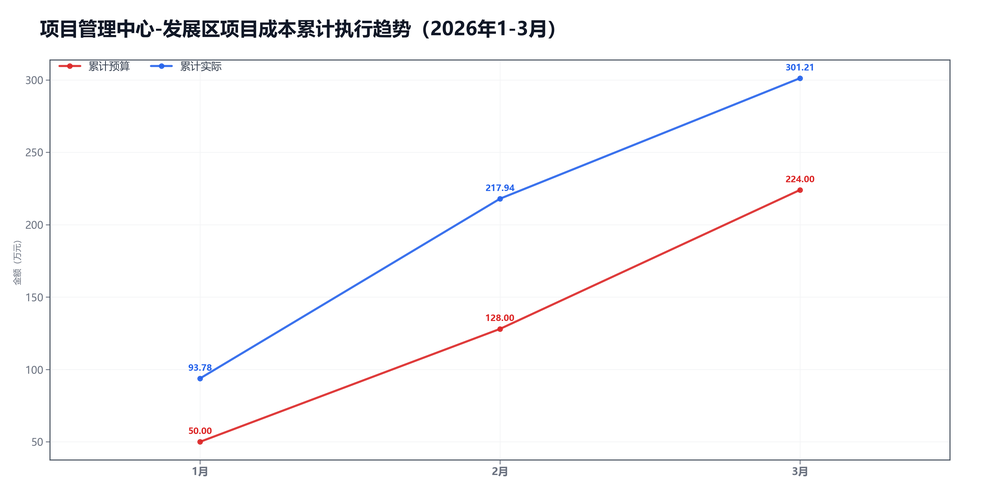
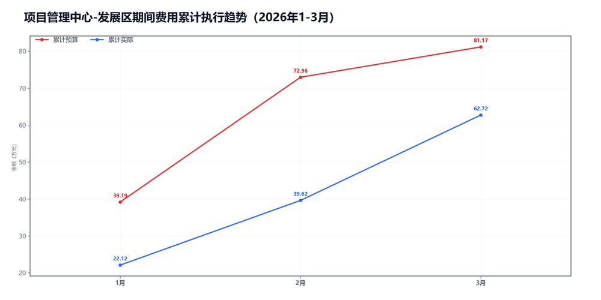

3月项目管理中心-发展区预算执行情况：

#### 一、结论

- 截至3月，累计超支71.18万，主因是项目成本。
- 收入没跟上，收入、毛利率和费用都在拉扯。

#### 二、数据

##### 口径说明
- 期间费用 = 人工费用 + 其他费用。
- 项目成本 = 净额收入 - 项目毛利润。

##### 1）收入达成

|指标|当月目标(万)|当月实际(万)|当月达成率|累计目标(万)|累计实际(万)|累计达成率|
|---|---|---|---|---|---|---|
|净额收入|183.00|73.38|40.1%|469.00|443.01|94.5%|
|项目毛利润|87.00|-9.89|-11.4%|245.00|141.79|57.9%|
|毛利率|47.5%|-13.5%|-61.0个点|52.2%|32.0%|-20.2个点|

##### 2）累计执行（1-3月）

|指标|累计预算(万)|累计实际(万)|累计省下了/超支|备注|
|---|---|---|---|---|
|项目成本|211.59|301.21|超支89.63|主压项|
|期间费用|81.17|62.72|节约18.44|人工+其他|
|合计|292.75|363.94|超支71.19|累计口径|

##### 3）当月预算控制

|指标|当月预算额度(万)|当月实际发生(万)|当月节约/超支|可结转至下月额度(万)|
|---|---|---|---|---|
|项目成本|96.00|83.27|节约12.73|96.00|
|期间费用|29.48|23.11|节约6.37|—|
|其中：人工费用|27.10|22.68|节约4.42|—|
|其中：其他费用|2.38|0.43|节约1.95|2.38|
|合计|125.48|106.37|节约19.11|—|

#### 三、分析

##### 收入达成情况
- 截至3月，累计净额收入443.01万，目标469.00万，比目标少25.99万。
- 累计项目毛利润141.79万，目标245.00万，比目标少103.21万。
- 累计毛利率32.0%，目标52.2%，偏差-20.2个点。
- 收入和毛利率都偏弱。

##### 支出达成情况
- 截至3月，累计偏差主要来自项目成本。项目成本超支89.63万，期间费用节约18.44万。
- 当月项目成本实际83.27万，预算96.00万；期间费用实际23.11万，预算29.48万。
- 项目成本主要构成：返费41.03万；其他运营成本34.91万；商业险4.03万。
- 当月期间费用较上月增加5.60万，人工增加7.82万，其他减少2.22万。
- 人工费用占比98.2%，其他费用占比1.8%。 返费/净额收入55.9%。
- 收入和毛利率都偏弱。

#### 四、建议

- 先抓最影响结果的那一项。

#### 五、图表附件

##### 项目成本累计执行

##### 期间费用累计执行

