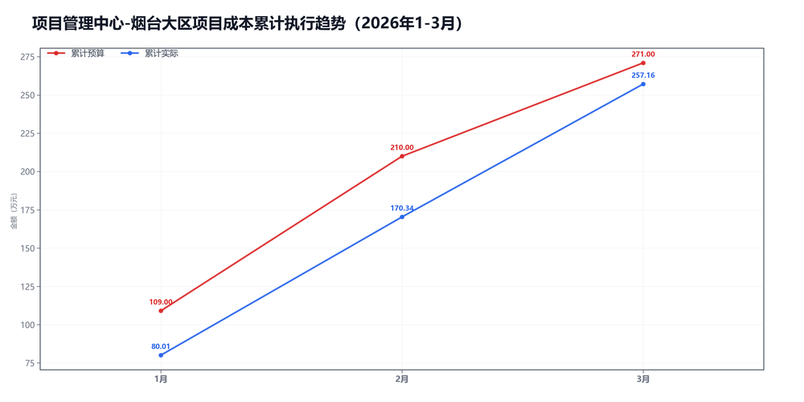
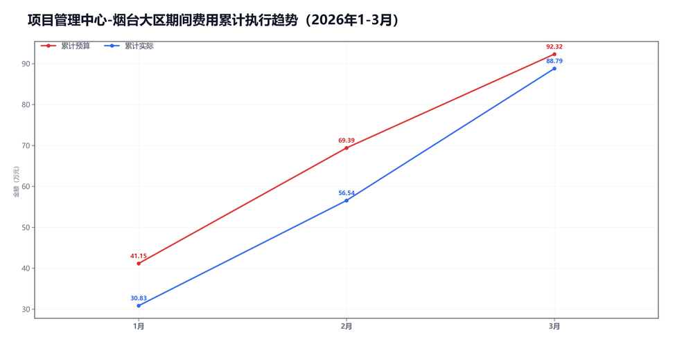

3月项目管理中心-烟台大区预算执行情况：

#### 一、结论

- 截至3月，累计省下了3.26万，主要来自期间费用。
- 收入没跟上。

#### 二、数据

##### 口径说明
- 期间费用 = 人工费用 + 其他费用。
- 项目成本 = 净额收入 - 项目毛利润。

##### 1）收入达成

|指标|当月目标(万)|当月实际(万)|当月达成率|累计目标(万)|累计实际(万)|累计达成率|
|---|---|---|---|---|---|---|
|净额收入|253.00|199.51|78.9%|839.00|795.33|94.8%|
|项目毛利润|192.00|112.69|58.7%|568.00|538.17|94.7%|
|毛利率|75.9%|56.5%|-19.4个点|67.7%|67.7%|-0.0个点|

##### 2）累计执行（1-3月）

|指标|累计预算(万)|累计实际(万)|累计省下了/超支|备注|
|---|---|---|---|---|
|项目成本|256.89|257.16|超支0.27|项目口径|
|期间费用|92.32|88.79|节约3.52|人工+其他|
|合计|349.21|345.96|节约3.25|累计口径|

##### 3）当月预算控制

|指标|当月预算额度(万)|当月实际发生(万)|当月节约/超支|可结转至下月额度(万)|
|---|---|---|---|---|
|项目成本|61.00|86.82|超支25.82|61.00|
|期间费用|29.14|32.25|超支3.11|—|
|其中：人工费用|28.13|31.85|超支3.72|—|
|其中：其他费用|1.01|0.40|节约0.61|1.01|
|合计|90.14|119.07|超支28.93|—|

#### 三、分析

##### 收入达成情况
- 截至3月，累计净额收入795.33万，目标839.00万，比目标少43.67万。
- 累计项目毛利润538.17万，目标568.00万，比目标少29.83万。
- 累计毛利率67.7%，目标67.7%，偏差-0.0个点。
- 收入没跟上。

##### 支出达成情况
- 截至3月，累计偏差主要来自期间费用。项目成本超支0.27万，期间费用节约3.52万。
- 当月项目成本实际86.82万，预算61.00万；期间费用实际32.25万，预算29.14万。
- 项目成本主要构成：其他运营成本41.27万；返费27.46万；商业险10.59万。
- 当月期间费用较上月增加6.53万，人工增加9.76万，其他减少3.23万。
- 人工费用占比98.8%，其他费用占比1.2%。
- 主要还是收入没跟上。

#### 四、建议

- 先把收入缺口补上。

#### 五、图表附件

##### 项目成本累计执行

##### 期间费用累计执行

