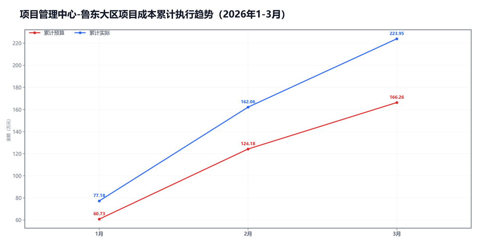
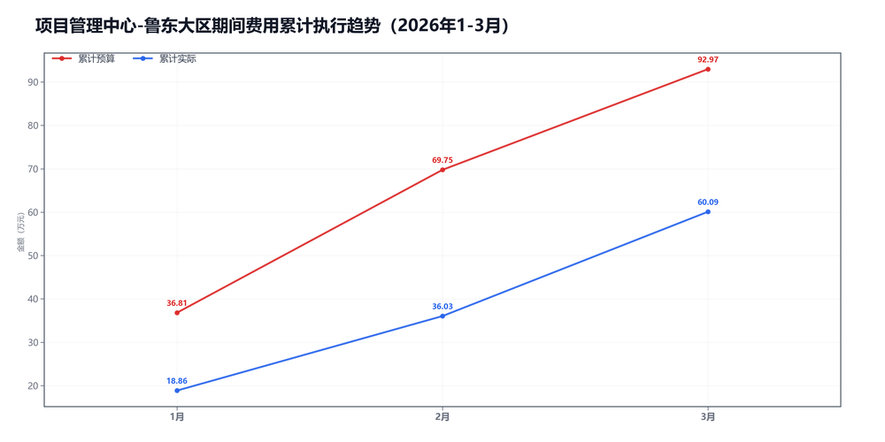

3月项目管理中心-鲁东大区预算执行情况：

#### 一、结论

- 截至3月，累计超支5.53万，主因是项目成本。
- 收入达成不错，毛利率低了-8.6个点，项目成本被顶上去了。

#### 二、数据

##### 口径说明
- 期间费用 = 人工费用 + 其他费用。
- 项目成本 = 净额收入 - 项目毛利润。

##### 1）收入达成

|指标|当月目标(万)|当月实际(万)|当月达成率|累计目标(万)|累计实际(万)|累计达成率|
|---|---|---|---|---|---|---|
|净额收入|116.26|104.91|90.2%|398.59|444.79|111.6%|
|项目毛利润|74.18|43.03|58.0%|232.33|220.85|95.1%|
|毛利率|63.8%|41.0%|-22.8个点|58.3%|49.7%|-8.6个点|

##### 2）累计执行（1-3月）

|指标|累计预算(万)|累计实际(万)|累计省下了/超支|备注|
|---|---|---|---|---|
|项目成本|185.53|223.95|超支38.41|主压项|
|期间费用|92.97|60.09|节约32.89|人工+其他|
|合计|278.51|284.03|超支5.52|累计口径|

##### 3）当月预算控制

|指标|当月预算额度(万)|当月实际发生(万)|当月节约/超支|可结转至下月额度(万)|
|---|---|---|---|---|
|项目成本|42.08|61.88|超支19.80|42.08|
|期间费用|25.38|24.06|节约1.32|—|
|其中：人工费用|22.41|22.53|超支0.12|—|
|其中：其他费用|2.97|1.53|节约1.44|2.97|
|合计|67.45|85.94|超支18.49|—|

#### 三、分析

##### 收入达成情况
- 截至3月，累计净额收入444.79万，目标398.59万，比目标多46.20万。
- 累计项目毛利润220.85万，目标232.33万，比目标少11.48万。
- 累计毛利率49.7%，目标58.3%，偏差-8.6个点。
- 收入达成不错，但毛利率不够。

##### 支出达成情况
- 截至3月，累计偏差主要来自项目成本。项目成本超支38.41万，期间费用节约32.89万。
- 当月项目成本实际61.88万，预算42.08万；期间费用实际24.06万，预算25.38万。
- 项目成本主要构成：返费30.09万；其他运营成本18.46万；商业险6.83万。
- 当月期间费用较上月增加6.88万，人工增加8.74万，其他减少1.86万。
- 人工费用占比93.6%，其他费用占比6.4%。 返费/净额收入28.7%。
- 主要还是毛利率不够。

#### 四、建议

- 先核对返费和定价。

#### 五、图表附件

##### 项目成本累计执行

##### 期间费用累计执行

