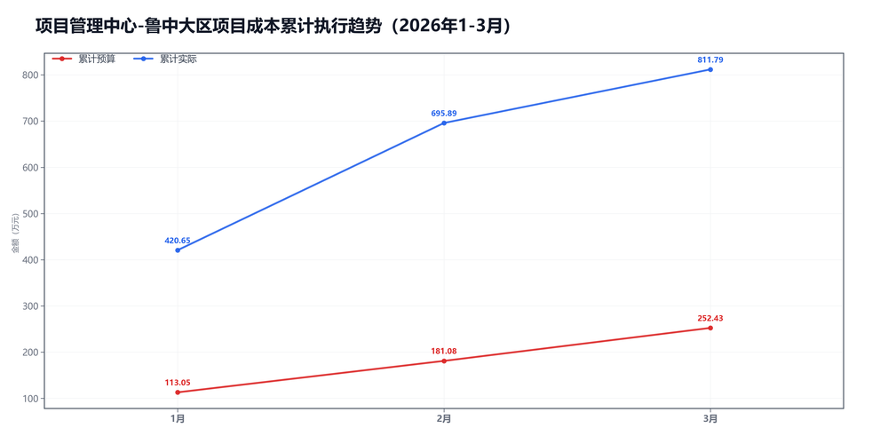
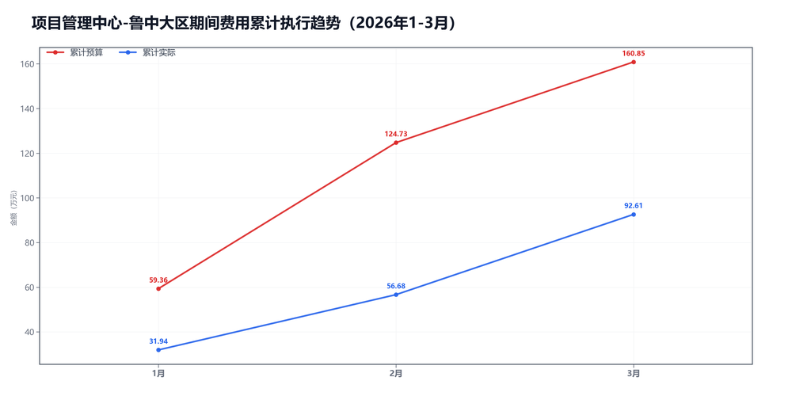

3月项目管理中心-鲁中大区预算执行情况：

#### 一、结论

- 截至3月，累计超支195.46万，主因是项目成本。
- 收入明显超目标，毛利率低了-16.6个点，项目成本被顶上去了。

#### 二、数据

##### 口径说明
- 期间费用 = 人工费用 + 其他费用。
- 项目成本 = 净额收入 - 项目毛利润。

##### 1）收入达成

|指标|当月目标(万)|当月实际(万)|当月达成率|累计目标(万)|累计实际(万)|累计达成率|
|---|---|---|---|---|---|---|
|净额收入|158.35|198.33|125.2%|733.43|1592.48|217.1%|
|项目毛利润|87.00|82.43|94.7%|481.00|780.68|162.3%|
|毛利率|54.9%|41.6%|-13.4个点|65.6%|49.0%|-16.6个点|

##### 2）累计执行（1-3月）

|指标|累计预算(万)|累计实际(万)|累计省下了/超支|备注|
|---|---|---|---|---|
|项目成本|548.10|811.79|超支263.70|主压项|
|期间费用|160.85|92.61|节约68.24|人工+其他|
|合计|708.94|904.40|超支195.46|累计口径|

##### 3）当月预算控制

|指标|当月预算额度(万)|当月实际发生(万)|当月节约/超支|可结转至下月额度(万)|
|---|---|---|---|---|
|项目成本|71.35|115.91|超支44.56|71.35|
|期间费用|22.63|35.93|超支13.30|—|
|其中：人工费用|20.73|34.29|超支13.56|—|
|其中：其他费用|1.90|1.64|节约0.26|1.90|
|合计|93.98|151.84|超支57.86|—|

#### 三、分析

##### 收入达成情况
- 截至3月，累计净额收入1592.48万，目标733.43万，比目标多859.04万。
- 累计项目毛利润780.68万，目标481.00万，比目标多299.68万。
- 累计毛利率49.0%，目标65.6%，偏差-16.6个点。
- 收入明显超目标，但毛利率不够。

##### 支出达成情况
- 截至3月，累计偏差主要来自项目成本。项目成本超支263.70万，期间费用节约68.24万。
- 当月项目成本实际115.91万，预算71.35万；期间费用实际35.93万，预算22.63万。
- 项目成本主要构成：返费85.43万；其他运营成本20.65万；附加税5.84万。
- 当月期间费用较上月增加11.19万，人工增加12.52万，其他减少1.33万。
- 人工费用占比95.4%，其他费用占比4.6%。 返费/净额收入43.1%。
- 主要还是毛利率不够。

#### 四、建议

- 先核对返费和定价。

#### 五、图表附件

##### 项目成本累计执行

##### 期间费用累计执行

