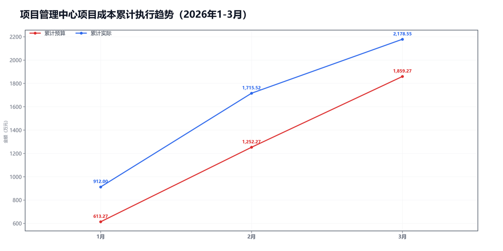
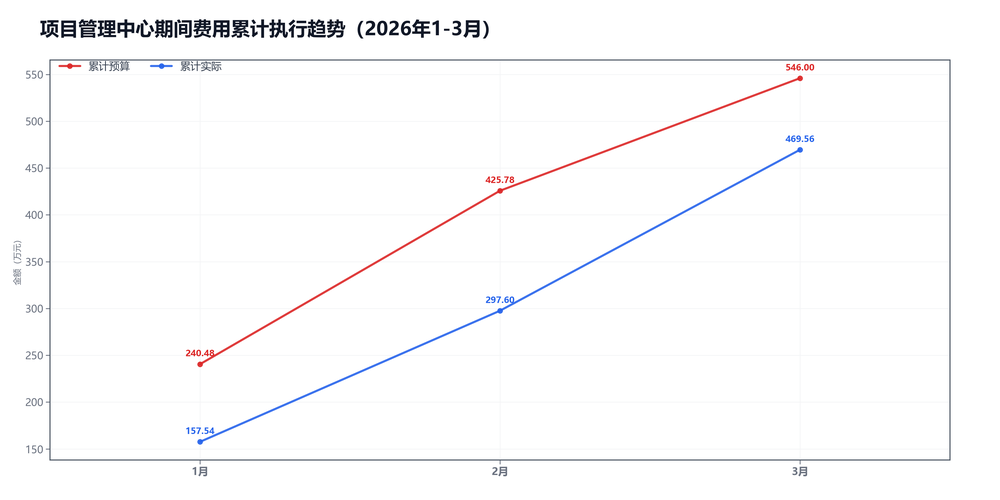

3月项目管理中心预算执行情况：

#### 一、结论

- 截至3月，累计超支27.23万，主因是项目成本。
- 收入达成不错，毛利率低了-2.1个点，项目成本被顶上去了。

#### 二、数据

##### 口径说明
- 期间费用 = 人工费用 + 其他费用。
- 项目成本 = 净额收入 - 项目毛利润。

##### 1）收入达成

|指标|当月目标(万)|当月实际(万)|当月达成率|累计目标(万)|累计实际(万)|累计达成率|
|---|---|---|---|---|---|---|
|净额收入|1360.00|999.77|73.5%|4473.27|4992.01|111.6%|
|项目毛利润|753.00|536.73|71.3%|2614.00|2813.46|107.6%|
|毛利率|55.4%|53.7%|-1.7个点|58.4%|56.4%|-2.1个点|

##### 2）累计执行（1-3月）

|指标|累计预算(万)|累计实际(万)|累计省下了/超支|备注|
|---|---|---|---|---|
|项目成本|2074.88|2178.55|超支103.67|主压项|
|期间费用|546.00|469.56|节约76.44|人工+其他|
|合计|2620.88|2648.11|超支27.23|累计口径|

##### 3）当月预算控制

|指标|当月预算额度(万)|当月实际发生(万)|当月节约/超支|可结转至下月额度(万)|
|---|---|---|---|---|
|项目成本|607.00|463.03|节约143.97|607.00|
|期间费用|157.23|171.96|超支14.73|—|
|其中：人工费用|142.95|165.04|超支22.09|—|
|其中：其他费用|14.28|6.92|节约7.36|14.28|
|合计|764.23|635.00|节约129.23|—|

#### 三、分析

##### 收入达成情况
- 截至3月，累计净额收入4992.01万，目标4473.27万，比目标多518.74万。
- 累计项目毛利润2813.46万，目标2614.00万，比目标多199.46万。
- 累计毛利率56.4%，目标58.4%，偏差-2.1个点。
- 收入达成不错，但毛利率不够。

##### 支出达成情况
- 截至3月，累计偏差主要来自项目成本。项目成本超支103.67万，期间费用节约76.44万。
- 当月项目成本实际463.03万，预算607.00万；期间费用实际171.96万，预算157.23万。
- 项目成本主要构成：返费208.67万；其他运营成本172.74万；附加税43.71万。
- 当月期间费用较上月增加31.91万，人工增加48.15万，其他减少16.24万。
- 人工费用占比96.0%，其他费用占比4.0%。 返费/净额收入20.9%。
- 主要还是毛利率不够。

#### 四、建议

- 先核对返费和定价。

#### 五、图表附件

##### 项目成本累计执行

##### 期间费用累计执行

